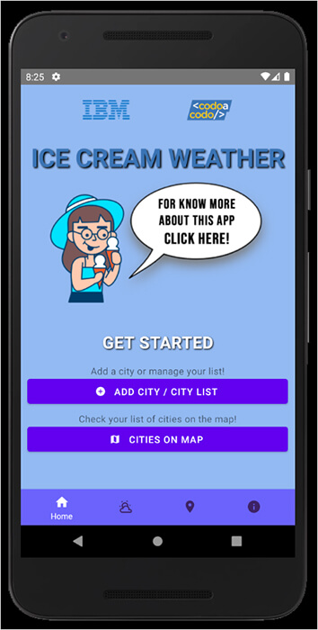
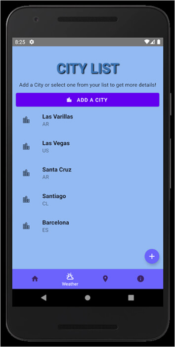
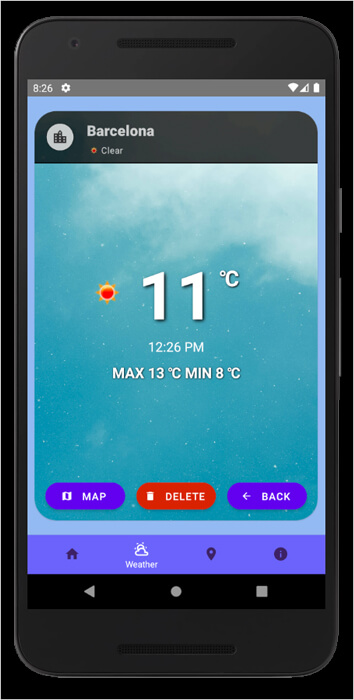
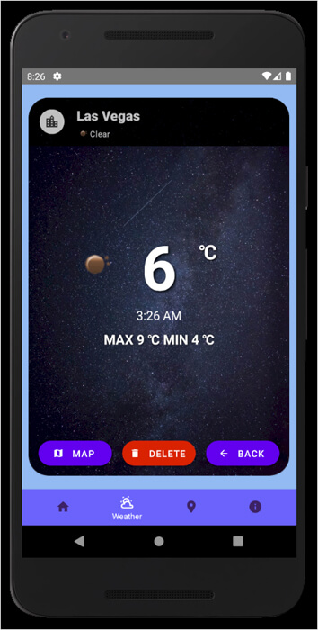
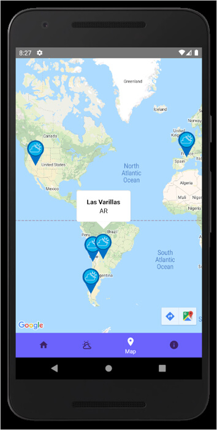
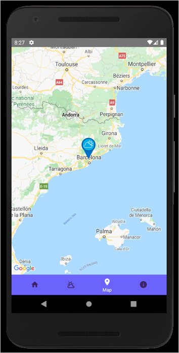

# <b> Ice Cream Weather</b>

Is a project from the specialization program on mobile development of IBM & CaC.

## 📋 <b> About the Project </b>

- [Project Description and Requirements](docs/ProjectRequirements.pdf)

## 📖 <b> About the Application </b>

Ice Cream Weather is an application in which you can add cities to a list, get their current weather, min/max temperature, the time and view them in the map.
This application fetch data from [Open WeatherMap](https://openweathermap.org/).

## 🛠️ <b> Technologies </b>

- [React Native](https://reactnative.dev)
- [React Navegation](https://reactnavigation.org/)
- [React Native Paper](https://reactnativepaper.com/)
- [React Native Maps](https://github.com/react-native-maps/react-native-maps)
- [React Native Country Picker Modal](https://github.com/xcarpentier/react-native-country-picker-modal)
- [React Native Vector Icons](https://github.com/oblador/react-native-vector-icons)
- [Axios](https://axios-http.com)
- [Moment](https://momentjs.com/)
- [JSON Server](https://github.com/typicode/json-server)
- [API: Open WeatherMap](https://openweathermap.org/)

## 📖 <b> Paper Protoype </b>

[Paper prototyping Version 1](docs/PaperPrototypingV1.jpeg)
[Paper prototyping Version 2: Home and About Us](docs/PaperPrototypingHomeAboutUs.jpg)
[Paper prototyping Version 2: Weather](docs/PaperPrototypingWeather.jpg)

## 📖 <b> Persona Canvas </b>


## 📷 <b> Preview </b>





## 🚀 <b> Setup / Launch</b>

### 🔧 <b>Local Installation</b>

```
git clone https://github.com/mgmaxi/weatherIBM
cd ./weatherIBM
npm install
```

### 🔑 <b>API Keys</b>

```
- Set APIKey for OpenWeatherMap on this files:
> views/CityWeather.js
> views/AddCity.js

const APIkey = '';

- Set APIKey for Google Maps on this file:
> android/app/src/main/AndroidManifest.xml

android:value="API_KEY"
```

### ⚙️ <b>Run it</b>

```
1) In one terminal start the server:
json-server --watch db.json

2) In another terminal start the app:
Android: "npx react-native run-android"
```
